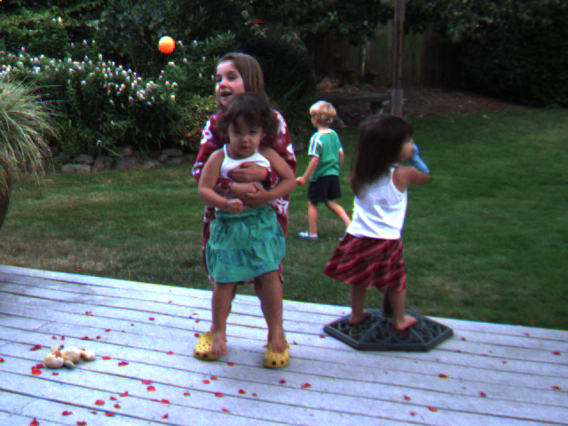

# Optical Flow Visualization

This project implements and visualizes optical flow using the Lucas-Kanade method. Optical flow is a computer vision technique that estimates motion patterns in image sequences, providing valuable information about how objects move within a scene.

## Features

- **Real-time optical flow visualization** from webcam input
- **Color-coded flow vectors** where color represents direction and intensity represents velocity magnitude
- **Customizable parameters** for smoothing, stride, and image downsampling
- **Support for both image files and webcam input**

## How It Works

The implementation follows these key steps:
1. **Derivative Calculation**: Computes spatial and temporal image derivatives
2. **Structure Matrix Construction**: Builds time-structure matrices from derivatives
3. **Velocity Estimation**: Solves the optical flow equation for motion vectors
4. **Visualization**: Renders motion vectors with direction-based color mapping

## Requirements

- Python 3.x
- OpenCV (`cv2`)
- NumPy

## Installation

```bash
# Clone this repository
git clone https://github.com/arda92a/Optical-Flow.git
cd optical-flow

# Install required packages
pip install opencv-python numpy
```

## Usage

### Webcam Demo

Run the webcam demo to see optical flow in real-time:

```bash
python optical_flow.py --webcam --smooth 3 --stride 1 --div 1
```

Parameters:
- `--smooth` (default: 3): Window size for smoothing the structure matrix
- `--stride` (default: 1): Downsampling factor for velocity calculation
- `--div` (default: 1): Downsampling factor for input images

### Image Processing

Process a pair of images to calculate optical flow:

```bash
python optical_flow.py --image1 first_image.jpg --image2 second_image.jpg --output flow_result.jpg
```

## Examples

### Input Images and Flow Result

The optical flow algorithm processes sequential frames to detect motion. Below are sample results:


*First input frame (starting point)*


*Second input frame (ending point)*


*Resulting optical flow visualization showing motion vectors*

### Movement Experiments

Below is a comprehensive visualization of different movement patterns and their corresponding optical flow representations:


*Various movement patterns and their optical flow signatures*

This visualization demonstrates how different types of motion (translation, rotation, scaling, etc.) appear in the optical flow field, providing a reference for interpreting flow patterns in real-world applications.

## Implementation Details

- **Box filtering** with integral images for efficient smoothing
- **Direction-colored visualization** using HSV color mapping
- **Aperture problem handling** for areas with insufficient texture
- **Velocity constraint** to avoid extreme flow vectors

## Advanced Options

You can adjust several parameters to balance accuracy and performance:

```bash
# Higher smoothing for noisy images
python optical_flow.py --webcam --smooth 5

# Increase stride for faster processing
python optical_flow.py --webcam --stride 2

# Decrease resolution for better performance
python optical_flow.py --webcam --div 2
```

## Troubleshooting

- **Slow performance**: Increase the `stride` and `div` parameters
- **Noisy flow vectors**: Increase the `smooth` parameter
- **Webcam not detected**: Check your camera connection and permissions

## License

[MIT License](LICENSE)

## Credits

This implementation is based on the Lucas-Kanade method for optical flow estimation.
